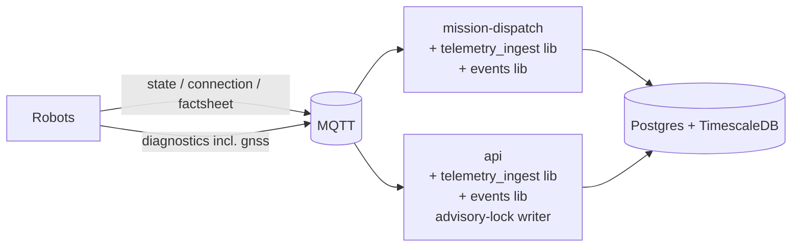

# SatiNav Fleet Agent — Phase 0: Data Foundations (v2, simplified)

**Goal:** record enough history for the agent to **see and explain issues**: which runs failed, what happened around the failure, and which software, site and cause were involved. Full replay-grade reconstruction is explicitly *not* a goal.

**Constraints**

- Simplest possible architecture.
- **No new long-running containers.**
- Live telemetry recording is **optional**, configurable per robot, site or globally.

**Duration:** about 3 weeks for about 1 to 1.5 engineers.

**Exit test:** for 5 real runs after rollout (including one failure and one disconnect), `GET /api/v1/runs/{run_id}/timeline` shows the outcome, the cause, the relevant events and the coarse telemetry around them. The team agrees it explains what happened.

---

## 1. Architecture summary

| Container | Status | Phase 0 responsibility |
|---|---|---|
| **postgres** | image swapped | TimescaleDB image `timescale/timescaledb-ha:pg17.11-ts2.30.1`. The 14 → 17 major upgrade is deliberate: we do it once, together with the dump/restore that happens anyway |
| **mission-dispatch** | existing | `mission_runs`, mission events (transactional); from `state`/`connection`/`factsheet` it writes `robot_state_ts` and `robot_latest`, and emits robot, battery, error, heartbeat and version events |
| **api** | existing | Runs migrations in its entrypoint; from `diagnostics` (incl. GNSS) it writes `diagnostics_ts` and emits GNSS, thermal, recovery and node events; adds endpoints for sites, runs, events and timeline; applies the fixes |
| graph-builder, mission-planner, livekit | existing | unchanged |
| mqtt-recorder | **optional** | stock `mosquitto_sub` sidecar, or run manually around test sessions |

**Shared code (libraries, not services)**

- `packages/events`: event codes, payload models, detectors, cause mapping and `emit()`.
- `packages/telemetry_ingest`: bounded queue, batch writer, recording-policy resolver.

**No** new broker, queue, database or long-running service.



---

## 2. Principles

1. **Write data where it is already read.** Dispatch already consumes `state`, and the API already consumes `diagnostics` and `nav_supervisor`. Phase 0 adds persistence inside those consumers.
2. **Enough to see the issue, not to replay it.** Store coarse telemetry and precise events. Discrete facts (state changes, errors, RTK drops, recoveries, run outcomes) are events. Continuous signals are only low-rate context.
3. **Single writer per table.** `fleet_events` is the one shared, append-only table, and it is written through one library.
4. **Events are transactional with state.** Dispatch writes the run update and its event in one transaction. There is no outbox and no bus.
5. **Telemetry can never hurt the command path.** Handlers never do database I/O directly; everything goes through a bounded queue to a background writer with its own small pool. Errors are swallowed and counted.
6. **Recording is policy-driven and visible.** The agent must be able to tell "nothing happened" from "nothing was recorded".

---

## 3. Schema

All DDL is managed by Alembic. **As built:** everything in §3 is created by one revision,
`packages/api/migrations/versions/20260924_01_phase0_core.py`; where it differs from the sketches
below, the migration wins. The differences are noted in each subsection.

### 3.1 `mission_runs`

```sql
CREATE TABLE mission_runs (
  run_id           uuid PRIMARY KEY,        -- dispatcher's existing run_id
  mission_name     text NOT NULL,
  robot_name       text NOT NULL,
  site_id          text,
  map_id           text,
  sw_version       text,                    -- build id snapshot at start
  recording_level  text NOT NULL,           -- full | events_only | off (at start)
  state            text NOT NULL,           -- RUNNING | COMPLETED | FAILED | CANCELED | ABORTED | TIMEOUT
  abort_cause      text REFERENCES cause_codes(code),
  abort_detail     jsonb,                   -- raw errors / navReasoning at termination
  passes_completed int NOT NULL DEFAULT 0,
  created_by       text,                    -- user id | 'api' | 'backfill'
  mission_tree     jsonb NOT NULL,          -- snapshot
  started_at       timestamptz NOT NULL,
  ended_at         timestamptz,
  summary_metrics  jsonb,                   -- filled in Phase 2
  CHECK ((state = 'RUNNING') = (ended_at IS NULL))
);
CREATE INDEX ON mission_runs (robot_name, started_at DESC);
CREATE INDEX ON mission_runs (site_id, started_at DESC);
CREATE INDEX ON mission_runs (sw_version);
```

- One run is one dispatcher `run_id`. Repeat passes are counted inside the run.
- A trigger blocks updates once the state is terminal, except to `summary_metrics`.
- `mission_trajectory` gets an `ADD COLUMN run_id uuid`, and dispatch fills it from now on.
- As built: the success state is `COMPLETED`, not `SUCCEEDED` (decided 2026-09-24, to match
  `MissionStateV1`). `state` and `recording_level` are enforced by named `CHECK` constraints. The
  trigger (`mission_runs_immutable_when_terminal`) raises `restrict_violation`. The migration also
  adds a partial index `trajectory_run_idx` on `mission_trajectory (run_id) WHERE run_id IS NOT NULL`.

### 3.2 `fleet_events` (hypertable)

```sql
CREATE TABLE fleet_events (
  ts          timestamptz NOT NULL,         -- robot time
  event_id    uuid NOT NULL,                -- deterministic uuid5
  robot_name  text,
  run_id      uuid,
  site_id     text,
  code        text NOT NULL,
  severity    text NOT NULL,                -- info | warning | error | critical
  sw_version  text,
  payload     jsonb NOT NULL DEFAULT '{}',
  source      text NOT NULL,                -- dispatch | api
  UNIQUE (event_id, ts)
);
SELECT create_hypertable('fleet_events', 'ts', chunk_time_interval => interval '7 days');
CREATE INDEX ON fleet_events (robot_name, ts DESC);
CREATE INDEX ON fleet_events (code, ts DESC);
CREATE INDEX ON fleet_events (run_id) WHERE run_id IS NOT NULL;
```

- The ID is `event_id = uuid5(NS, f"{code}|{robot}|{ts_utc_µs}|{discriminator}")` and inserts use `ON CONFLICT DO NOTHING`, so replays and duplicate messages can never create duplicate events.
- Events are kept indefinitely, and chunks older than 14 days are compressed.
- As built: `severity` and `source` are enforced by `CHECK` constraints; compression is segmented
  by `robot_name`, ordered by `ts DESC`. There is no foreign key from `code` or `run_id`.

### 3.3 Event codes (v1)

| Code | Producer | Trigger |
|---|---|---|
| `MISSION.RUN_STARTED` / `RUN_FINISHED` | dispatch | run lifecycle (payload: outcome, cause) |
| `MISSION.NODE_FAILED` | dispatch | node status failure |
| `MISSION.REROUTED` / `EDGE_BLOCKED` | dispatch | `blocked*`/`held*` change |
| `MISSION.CANCEL_REQUESTED` | api | cancel route (payload: actor) |
| `ROBOT.STATE_CHANGED` | dispatch | `state` diff |
| `ROBOT.ONLINE` / `OFFLINE` | dispatch | `connection` topic |
| `ROBOT.HEARTBEAT_LOST` / `HEARTBEAT_RESTORED` | dispatch | no `state` within `spec.heartbeat_timeout` |
| `ROBOT.ERROR_RAISED` / `ERROR_CLEARED` | dispatch | set diff on VDA5050 `errors[]` by `errorType` |
| `ROBOT.SW_VERSION_CHANGED` | dispatch | build-id diff |
| `BATTERY.LOW` / `BATTERY.OK` | dispatch | 20 % / 25 % hysteresis |
| `GNSS.RTK_LOST` / `RTK_RECOVERED` | api | `gnss.fix` changes between consecutive diagnostics samples |
| `NAV.RECOVERY_ENTERED` / `RECOVERY_EXITED` | api | `nav_supervisor` DRIVE↔RECOVER (payload: cause, duration) |
| `NAV.GOAL_BLOCKED` | api | `nav_supervisor` blocked-goal cause |
| `SYSTEM.THERMAL_HIGH` / `THERMAL_OK` | api | 85 °C / 78 °C hysteresis |
| `SYSTEM.NODE_DOWN` / `NODE_UP` | api | ROS node health in diagnostics |
| `MAP.DELETE_FAILED` | api | delete saga exhausted retries |
| `TELEMETRY.RECORDING_CHANGED` | api | policy change (**always written, even at level `off`**) |

Codes are append-only: they are never renamed or reused, only deprecated.

### 3.4 Telemetry hypertables (coarse, optional)

| Table | Writer | Rate | Columns |
|---|---|---|---|
| `robot_state_ts` | dispatch | every 5 s + immediately on state/order/error change | ts, robot_name, run_id, x, y, yaw, map_id, battery, state, order_id, last_node, driving |
| `diagnostics_ts` | api | the existing diagnostics rate | ts, robot_name, cpu, gpu, ram, temp_max, power_w, nodes_down, **gnss_fix, gnss_sats, gnss_h_acc_m, gnss_corr_age_s** |

- **Retention:** 30 days of raw data. Rollups (`robot_state_1m`, `diagnostics_1m`) are kept for 2 years, and raw chunks older than 3 days are compressed.
- As built: 1-day chunks, compression segmented by `robot_name`. The rollups are continuous
  aggregates on 1-minute buckets, keyed `(bucket, robot_name)`, refreshed every 5 min over the last
  2 days (end offset 2 min). Their columns were designed during implementation; see the migration.
  `robot_state_1m`: `samples`, last-value `run_id`/`x`/`y`/`yaw`/`map_id`/`state`/`order_id`/`last_node`,
  `battery_avg`, `battery_min`, `driving` (`bool_or`). `diagnostics_1m`: `samples`, avg and max of
  `cpu`/`gpu`/`ram`, `temp_max`, `power_w_avg`, `nodes_down_max`, last `gnss_fix`, `gnss_sats_min`,
  `gnss_h_acc_m_max`, `gnss_corr_age_s_max`.
- **Not stored as time series:** BT state, nav_supervisor samples and full jtop payloads. The events above cover what the agent needs.

### 3.5 `robot_latest`

```sql
CREATE TABLE robot_latest (
  robot_name     text PRIMARY KEY,
  state_msg      jsonb, diagnostics jsonb, nav_supervisor jsonb,
  active_run_id  uuid, site_id text, sw_version text,
  last_seen      timestamptz, updated_at timestamptz NOT NULL DEFAULT now()
);
```

Dispatch owns the state columns and the API owns the diagnostics columns; each upserts only its own. The row is **always** written regardless of recording level, because the detectors need it to rehydrate after a restart (otherwise every restart would emit spurious events).

### 3.6 Sites and assignment history

```sql
-- siteobjectv1 (existing object-class convention):
--   spec { customer, display_name, sector, geofence, gps_datum, rtk_base, timezone,
--          telemetry_recording }            -- optional override
CREATE EXTENSION IF NOT EXISTS btree_gist;
CREATE TABLE robot_site_assignments (
  robot_name text NOT NULL, site_id text NOT NULL,
  valid tstzrange NOT NULL, assigned_by text,
  EXCLUDE USING gist (robot_name WITH =, valid WITH &&)
);
```

The site is resolved at write time and stored into runs and events.

### 3.7 `cause_codes`, `audit_log`, `idempotency_keys`

```sql
CREATE TABLE cause_codes (code text PRIMARY KEY, category text NOT NULL, title text NOT NULL, description text);

CREATE TABLE audit_log (
  id bigserial PRIMARY KEY, ts timestamptz NOT NULL DEFAULT now(),
  actor text NOT NULL, actor_kind text NOT NULL,
  method text, route text, resource_kind text, resource_id text,
  status int, request_id uuid, idempotency_key text, diff jsonb
);

CREATE TABLE idempotency_keys (
  key text, actor text, route text, request_hash text NOT NULL,
  response_status int, response_body jsonb, created_at timestamptz NOT NULL DEFAULT now(),
  PRIMARY KEY (key, actor, route)
);
```

`cause_codes` is seeded with about 20 codes: `NAV.GOAL_UNREACHABLE`, `NAV.RECOVERY_EXHAUSTED`, `GNSS.RTK_LOST`, `POWER.LOW_BATTERY`, `COMMS.HEARTBEAT_LOST`, `OPERATOR.CANCELED`, `DISPATCH.TIMEOUT`, `DISPATCH.ORPHANED`, `HW.FAULT`, `UNKNOWN`, and so on.
As built: exactly 20 rows, copied verbatim from `packages/events/causes.py` `CAUSE_CODES`.
`siteobjectv1` (§3.6) is not in the migration: it follows the runtime object-class convention.

---

## 4. Optional live-data recording

### 4.1 Levels

| Level | Stored | Not stored |
|---|---|---|
| `full` | runs, events, `robot_state_ts`, `diagnostics_ts`, `robot_latest` | — |
| `events_only` **(default)** | runs, events, `robot_latest` | time series |
| `off` | runs, `robot_latest`, `TELEMETRY.RECORDING_CHANGED` | events, time series |

### 4.2 Resolution

The level is resolved per robot, in this order of precedence:

1. `robotobjectv1.spec.telemetry_recording`
2. `siteobjectv1.spec.telemetry_recording` of the robot's current site
3. `settingsobjectv1.telemetry_recording` (global)

### 4.3 Behaviour

- The resolved level is cached per robot in dispatch and the API. The cache is refreshed on the existing robot, site and settings NOTIFYs, so no restart is needed.
- The **check happens before enqueueing.** Detectors always run in memory, so changing the level takes effect immediately without spurious events.
- Every change emits `TELEMETRY.RECORDING_CHANGED` (old level, new level, scope, actor), and each run stores the `recording_level` that applied at its start.
- The timeline endpoint returns explicit `not_recorded` intervals, so the agent never mistakes silence for normal behaviour.
- The MQTT recorder is independent of this and optional (§5.4).

---

## 5. Component changes

### 5.1 `packages/events`

- `codes.py`: a `StrEnum` plus a metadata table (default severity, discriminator required, payload model).
- `schemas.py`: one Pydantic payload model per code. An invalid payload is logged and stored with `_invalid: true` in production, and raises in tests.
- `ids.py`: deterministic `uuid5`, with UTC microsecond normalization.
- `detectors.py`: pure state machines `StateDiff`, `SetDiff`, `Hysteresis` and `Timeout`. Time is injected and there is no `now()`.
- `causes.py`: an ordered first-match rule list mapping raw errors/`navReasoning` to a cause code; unmatched input maps to `UNKNOWN`.
- `emit.py`: `build_row()` is pure, and `emit(conn, event, ctx)` takes a **connection** (never a pool) so the caller owns the transaction. There is one driver adapter, matching the driver your services use.
- `EventContext` is a protocol with `site_for`, `run_for` and `sw_version_for`, implemented by each host.

### 5.2 `packages/telemetry_ingest`

- `queue.py`: a bounded `asyncio.Queue`, filled with `put_nowait()` from MQTT handlers. When it's full, telemetry rows are dropped and counted, and events are spilled to a local JSONL file that is replayed on the next successful flush.
- `writer.py`: a background task that flushes every 1 s or every 500 rows. It uses COPY for time series and `executemany … ON CONFLICT DO NOTHING` for events, runs on a **separate pool of 2 connections**, and catches every exception.
- `policy.py`: resolves the recording level (§4.2) with a NOTIFY-refreshed cache.
- `rehydrate.py`: loads `robot_latest` into the detectors at startup.
- `metrics.py`: counters for rows written, rows dropped, events spilled, flush duration and queue depth.

### 5.3 Host integrations

**mission-dispatch**

1. On run start: `INSERT mission_runs` together with `MISSION.RUN_STARTED`, in one transaction.
2. On a terminal state: update the run and emit `MISSION.RUN_FINISHED`, in one transaction.
3. Emit `NODE_FAILED`, `REROUTED` and `EDGE_BLOCKED` where the status fields are already updated.
4. Write `run_id` into `mission_trajectory`.
5. The `state`, `connection` and `factsheet` handlers feed the detectors and enqueue `robot_state_ts` rows and `robot_latest` upserts.
6. Run a 1 Hz heartbeat sweep that emits `HEARTBEAT_LOST`/`RESTORED`.
7. **Orphan reconciliation on startup:** a `RUNNING` run whose robot no longer reports its order is closed as `ABORTED` with cause `DISPATCH.ORPHANED`.

**api**

1. The entrypoint runs `alembic upgrade head` inside `pg_advisory_lock('migrations')`, then starts uvicorn.
2. Only the worker holding `pg_try_advisory_lock('telemetry_writer')` on a dedicated connection writes diagnostics data and derives events. The other workers keep only their existing in-memory cache, and the lock moves to another worker if the holder dies.
3. The `diagnostics` handler feeds the detectors (GNSS, thermal, nodes) and enqueues `diagnostics_ts` rows and `robot_latest` upserts.
4. The `nav_supervisor` handler feeds the recovery and blocked-goal detectors. It emits events only; no time series is stored.
5. New routes (§5.5) and fixes (§6).

### 5.4 Optional recorder

```yaml
mqtt-recorder:          # optional, remove freely
  image: eclipse-mosquitto:2
  entrypoint: ["sh","-c","mosquitto_sub -h mqtt -u recorder -P $$PW -t '#' -T 'robot/image_upload' -F '%I %t %p' | gzip > /data/mqtt-$$(date +%F-%H%M).log.gz"]
  volumes: ["mqtt-recordings:/data"]
  profiles: ["recording"]  # only runs with: docker compose --profile recording up
```

- The broker user `recorder` has a subscribe-only ACL.
- A tiny `tools/mqtt_replay.py` parses this format. It **always drops command topics** (`order`, `instantActions`), rewrites the prefix to `replay/`, and refuses to target the production broker without an explicit flag.
- A shared `incidents.yaml` next to the recordings lists notable incidents (robot, time window, what happened). This is the seed for Phase 1 evaluation.

### 5.5 New API routes

```
GET  /api/v1/sites                       CRUD
PUT  /api/v1/robots/{name}/site          closes the previous assignment, opens a new one
GET  /api/v1/robots/{name}/site-assignments
GET  /api/v1/runs?robot=&site=&state=&sw_version=&from=&to=&cursor=
GET  /api/v1/runs/{run_id}               run + events
GET  /api/v1/runs/{run_id}/timeline      events + coarse tracks + trajectory + not_recorded gaps
GET  /api/v1/events?robot=&site=&code=&severity=&from=&to=&cursor=
```

The recording level is set through the existing robot and settings routes and the new site route; the fields are validated.

### 5.6 Robot side

1. **GNSS in diagnostics.** Add four fields to the existing diagnostics message, sent at the existing rate:
   ```json
   "gnss": { "fix": "RTK_FIXED", "sats": 18, "h_acc_m": 0.014, "corr_age_s": 1.0 }
   ```
   `fix` comes from the driver's carrier solution (u-blox NAV-PVT `carrSoln`, Septentrio PVTGeodetic `Mode`), **not** from `NavSatFix`, which can't distinguish float from fixed. If the block is absent, the ingest treats it as NULL.
2. **Build ID** in the existing version field: `<platform>-<calver>+g<sha>[.dirty]`, baked into `/etc/satinav/build.json` at image build time. A robot without it reports `unknown`.
3. **chrony** synced against the cloud server over Tailscale, with the public pool as fallback and `makestep 1 3`, targeting under 1 s offset.
4. Keep VDA5050 `errorType` values stable, and put free text in `errorDescription`.

---

## 6. Fixes to existing behaviour

| # | Issue | Fix |
|---|---|---|
| F1 | Map delete soft-deletes Postgres even when the Arango/MinIO deletes fail | Set `lifecycle=DELETING` and return **202**. A background task then deletes from Arango and MinIO (idempotent, "not found" counts as success) and sets `DELETED`. On failure it retries with backoff and emits `MAP.DELETE_FAILED` after N attempts. `DELETING` maps are hidden from lists, and assigning one returns 409. |
| F2 | Settings PUT silently drops unknown keys | `SettingsUpdateV1(extra="forbid")` returns **422** with the unknown keys. Updates are partial, and the diff goes to `audit_log`. The new `telemetry_recording` field is added here. |
| F3 | No idempotency | Middleware on mission create, navigate/waypoints, robot actions, cancel-order, mission cancel, and map create/delete. The same key and hash returns the stored response; the same key with a different hash returns 422; keys expire after 24 h. |
| F4 | No audit trail | Middleware on all mutating routes, logging actor, route, resource, status, request_id and a sanitized diff. Robot telemetry is not audited. |
| F5 | Mission creator unknown | `created_by` is set server-side from auth and never taken from the request body. |

---

## 7. Step-by-step plan

### Week 1 — Foundations

**Day 1: preparation**

- [ ] Confirm the Postgres major version, the database driver (asyncpg or psycopg), the number of API workers, the GNSS driver per platform, and where the software version is currently reported.
- [ ] Set up a staging compose environment with a copy of the production database (reused in every later phase).

**WP1: TimescaleDB and Alembic (days 1–3)**

1. Pin `timescale/timescaledb-ha:pg17.11-ts2.30.1`. This deliberately upgrades Postgres from 14.5 to 17: we do the major upgrade once, together with the dump/restore that happens anyway. The image includes PostGIS, which you'll want later for geofences.
2. Configure it: `shared_preload_libraries='timescaledb'`, `timescaledb.telemetry_level=off`, run `timescaledb-tune`, and set the server timezone to UTC.
3. **Done on staging** (bridge-network rehearsal, commit c5dbb4d). On staging, dump, start the new image, restore, run `CREATE EXTENSION timescaledb`, and diff row counts and schema. The result: the catalog diff was empty and row counts matched. The dump is `pg_dump` of the app database, not `pg_dumpall`, because production has only the app role, which the image creates from `POSTGRES_USER`. The restore runs as the app role (`--no-owner --role=<app role>`), which resolves the pg15+ `public`-schema privilege change.
4. **Done on staging** (same rehearsal). LISTEN/NOTIFY dispatch went `PENDING -> RUNNING`, and the test suite ran. Its 82 pre-existing failures are marked xfail in `tests/conftest.py` and are unrelated to Postgres.
5. **Done, in production since 2026-09-24 18:14 (window 1, merged in cb29036).** Add Alembic to the API package:
   - an empty baseline revision, applied with `alembic stamp`;
   - autogenerate **disabled**;
   - an `include_object` filter that excludes the `*objectv1` tables;
   - raw-SQL migrations only;
   - date-prefixed revision IDs.
6. **Written; window 2 ready** (branch `phase0/alembic`; procedure, verified on a throwaway copy of production, in the runbook's "Window 2" section). Write migration `…_01_phase0_core` containing all §3 tables, hypertables, compression and retention policies, continuous aggregates, the `cause_codes` seed and the `mission_runs` immutability trigger.
7. **Entrypoint: done (window 1). Dispatch table wait: on `phase0/alembic`, ships in window 2.** Add the migration step to the API entrypoint under an advisory lock, and make dispatch retry its DB init until the tables exist.
8. **Done: production cut over 2026-09-24 16:45** (~38 s downtime; see the runbook's "Post-cutover log"). Migrate production in a maintenance window. The full procedure is in `docs/satinav-fleet-agent-phase0-cutover-runbook.md`. In outline:
   - wait until no robot is `ON_TASK`;
   - stop dispatch, then the API, then graph-builder, then mission-planner;
   - dump, restore and verify;
   - start the services again.

   Keep the old volume for 2 weeks as a rollback.

   **Prerequisite:** the pre-window volume fix (runbook §0) is deployed first. It pins production's current Postgres volume as a named external volume. Without it there is nothing stable to roll back to (see the known issue below).
   **Ordering rule:** Alembic / `phase0_core` (steps 5–7) must **not** merge before this cutover. The API entrypoint runs `alembic upgrade head`, which would fail against pg14 without TimescaleDB and keep the API from starting.

> **Known issue (fixed 2026-09-24: runbook §0 deployed): Postgres data resets on full restart.** The production `postgres` service declares no volume, so it only gets the image's anonymous volume. `restart_services.sh` (`down` then `up -d`) therefore starts a fresh, empty volume each time. The host has ~190 orphaned PG14 data volumes (2025-10 → 2026-09), so production has very likely been reset to an empty database on each full restart. A few of those volumes may be test leftovers. Until the runbook §0 fix lands, don't run `restart_services.sh` and don't prune volumes. The owner has to decide whether any orphaned volume holds data worth recovering.

**WP2: `packages/events` (days 1–5, in parallel)** — **Done** (on `main` since 30a6388).

1. Codes registry and payload models for every code in §3.3.
2. Deterministic IDs, with a test that the same input gives the same ID across processes.
3. Detectors, with table-driven golden tests for each type (including hysteresis boundaries and heartbeat timeouts).
4. Cause rules, with one test per rule plus an `UNKNOWN` fallback test.
5. `build_row`, `emit` and the `EventContext` protocol.

**WP3: Robot side on one robot (days 2–5)**

1. Add the GNSS block to the diagnostics publisher and verify that `fix` transitions show up.
2. Bake `build.json` into the image build and report it in the version field.
3. Configure chrony and verify the offset stays under 1 s over 24 h.
4. Soak for 48 h. Rollout to the golden image waits until week 2 ingest consumes the data.

**WP4: Optional recorder (day 2)**

1. Create the broker user `recorder` with a subscribe-only ACL.
2. Add the compose service under the `recording` profile, and write `mqtt_replay.py` with the command-topic filter and a test for it.
3. Start `incidents.yaml`.

**Week 1 acceptance**

- Production runs on TimescaleDB, and `alembic current` shows the head revision.
- All Phase 0 tables exist.
- The events library is fully tested.
- The test robot publishes GNSS data and a build ID.

### Week 2 — Ingest inside existing services

**WP5: `packages/telemetry_ingest` (days 1–2)** — **Done** (merged e3b728b; refresh backoff 6ba0ee4).

1. Queue, writer (COPY, events upsert, separate pool, catch-all), spill file and replay-on-flush.
2. Policy resolver with the NOTIFY-refreshed cache.
3. Rehydration from `robot_latest`.
4. Metrics.
5. Unit tests with a fake clock and a fake database; one test kills the writer mid-batch and checks that events are not lost.

**WP6: Dispatch integration (days 2–4)** — **Done, in production since 2026-09-24 21:00** (merged 5433b3a; `mission-dispatch:pre-wp6` is the rollback image; kill switch `DISABLE_FLEET_RECORDING=1`). As built: run rows are written by an ordered background worker on the telemetry pool, never in the mission-object transaction; `mission_trajectory.run_id` is back-filled at run finish (graph-builder owns that table); orphan reconciliation leaves runs the dispatcher will resume alone. Also fixed a pre-existing hot loop in `Robot.run` that made 8 dispatcher test files spin unbounded.

1. Transactional `mission_runs` insert and finish with their events.
2. Node, reroute and blocked events.
3. `run_id` in `mission_trajectory`.
4. `state`, `connection` and `factsheet` handlers feeding the detectors, `robot_state_ts` (every 5 s plus on change) and `robot_latest`.
5. The heartbeat sweep.
6. Orphan reconciliation.
7. Integration test: replay a recording (or a synthetic sequence) twice and check that the event set is identical; restart dispatch mid-stream and check there are no spurious events.

**Dummy robot needs a goal-following mode.** — **Done** (merged f06b6c9: `--mode goal` / `DUMMY_ROBOT_MODE=goal`). `tests/dummy_robot/dummy_robot.py` currently free-runs its own circular patrol regardless of the VDA5050 order it receives — it never reports reaching an ordered waypoint or finishing an order. `MISSION.RUN_FINISHED` (item 1 above) and orphan reconciliation (item 6) both need a robot that actually completes an order to test the success path, not just the timeout/failure paths. Add a mode where it follows the ordered waypoints and reports FINISHED when done, before relying on it for WP6's integration tests.

**WP7: API integration (days 3–5)** — **Done, in production since 2026-09-24 21:00** (merged 7f1b573; `api_delegation_service:pre-wp6` rollback; kill switch `TELEMETRY_INGEST_ENABLED=false`). GNSS detection deferred (columns stay NULL). Production runs 1 uvicorn worker, which always holds the writer lock. "Node down" = stale ros_health source or missing monitored topic; `NAV.GOAL_BLOCKED` cause = `last_drive_cause`.

1. The advisory-lock writer election.
2. `diagnostics` handler: `diagnostics_ts` with GNSS columns, GNSS/thermal/node detectors, `robot_latest`.
3. `nav_supervisor` handler: recovery and blocked-goal events only.
4. Integration test with 2 API workers: exactly one writes, and when it's killed the other takes over.

**WP8: Recording policy (day 5)** — **Done, in production since 2026-09-24 21:51** (merged b584514; rollback images `:pre-wp8`). Robot and global levels only; site levels wait for WP9 (site spec field, `siteobjectv1` watcher → `policy.set_site_level`, assignments → `set_robot_site`). `RECORDING_CHANGED` is written in the same transaction as the object change; `actor` is null until F4/F5. Level changes apply via NOTIFY within ~0.1–0.4 s (60 s reload as safety net). Also: mission-dispatch now writes only the robot-spec keys it owns (`update_spec_fields`: datum, needs_order_cancel), so it can no longer revert an operator's change from its cached copy. Verified live: formidable-peacock → `full` wrote `robot_state_ts` rows and survived datum messages; reset to inherit stopped them; invalid value → 422.

1. Add the `telemetry_recording` field to settings (F2 model), robot spec and site spec.
2. Emit `TELEMETRY.RECORDING_CHANGED` on every change.
3. Store `recording_level` on runs.
4. Test each level: check what is and isn't written, and that switching takes effect without a restart.

**Rollout at the end of week 2:** bake the robot-side changes into the golden image and deploy dispatch and the API while no robot is `ON_TASK`.

**Week 2 acceptance**

- Live runs create `mission_runs` rows and events.
- Coarse telemetry is written for robots at level `full`.
- Levels switch correctly.
- Nothing is duplicated when using multiple API workers.

### Week 3 — API surface, fixes, verification

**WP9: Sites (day 1)** — **Done, in production since 2026-09-24 22:34** (merged a1d5f2d; rollback images `:pre-wp9`). Verified live with a throwaway `test-site` (created, assigned, recording switched to `full` via the site, delete refused while assigned, unassigned, deleted); one closed assignment row for formidable-peacock remains as history.

- CRUD routes and the assign route (close the previous range and open a new one in one transaction).
- Site resolution in the events `EventContext` and in run start.

As built (branch `phase0/sites`, not yet merged):

- `SiteObjectV1` (`cloud_common/objects/site.py`) is in `ALL_OBJECTS`, so every service creates
  `siteobjectv1` at startup; services still on the old object list simply never touch it. The site id
  is the object name (`^[A-Za-z0-9][A-Za-z0-9_.:-]{0,99}$`). Spec fields are all optional; `geofence`
  must be a GeoJSON object, `timezone` an IANA name.
- Routes (`packages/api/main.py`, logic in `packages/api/sites.py`): `GET/POST /api/v1/sites`,
  `GET/PUT/DELETE /api/v1/sites/{site_id}` (PUT is partial; unknown fields 422; duplicate 409; delete
  409 while an existing robot is assigned), `PUT /api/v1/robots/{name}/site` (`{"site_id": "s1" | null}`),
  `GET /api/v1/robots/{name}/site-assignments` (newest first).
- The assign route serialises per robot (transaction-scoped advisory lock), takes the timestamp
  *after* the lock (`clock_timestamp()`), closes the open range at that instant and opens `[ts, ∞)`,
  all in one transaction; the same site again is a no-op.
- NOTIFY: site writes use the object convention (channel `siteobjectv1`); assignment changes send
  `pg_notify('robot_site_assignments', {"robot_name", "site_id"})` from the same transaction.
  Dispatch and the API writer push both into the recording policy (measured 0.05–0.3 s); on every
  (re)subscribe the policy reloads, and the 60 s reload stays as a safety net.
- `RECORDING_CHANGED`: scope `site` (robot_name NULL, site_id set) when a site's level changes;
  scope `robot` when an assignment changes the robot's *effective* level (nothing if the robot has
  its own level or both sites resolve the same).
- Site on runs/events: dispatch resolves it from the policy at run start and per event; the API's
  event context now also takes it from the policy (the robot's current assignment), falling back to
  `robot_latest.site_id` only until the policy has loaded. Dispatch clears `robot_latest.site_id`
  on unassign. A run keeps the site it started at.

**WP10: Read endpoints (days 1–3)**

- `/runs`, `/runs/{id}`, `/events` with cursor pagination.
- `/runs/{id}/timeline`: events, rollup or raw tracks depending on window length, the trajectory, and `not_recorded` intervals derived from the recording level and `RECORDING_CHANGED` events.

**WP11: Fixes F1–F5 (days 2–4)**

Tests for each fix: the map delete saga under an injected Arango or MinIO failure, settings returning 422, idempotent replay of the same request, audit rows written, and `created_by` not spoofable.

**WP12: Backfill (day 4)**

- One `mission_runs` row per terminal `missionobjectv1` that has a `run_id`, with `created_by='backfill'`, `sw_version` NULL and the cause mapped.
- `mission_trajectory.run_id` filled where the time window matches exactly one run.
- Current sites created, with each robot's assignment valid from its `created_at` onwards.

**WP13: Observability and exit test (day 5)**

- Metrics exposed. Alert on writer queue > 80 %, spilled events > 0 for 5 min, and heartbeat sweep lag.
- Run the exit test (5 runs, including one failure and one disconnect) and record the share of `UNKNOWN` causes as a baseline.

---

## 8. Definition of done

- [ ] Postgres is on TimescaleDB, and all new DDL is managed by Alembic from the API entrypoint.
- [ ] There are **no new long-running containers**; the recorder is optional under a compose profile.
- [ ] Every run after rollout has exactly one `mission_runs` row with version, site, cause and recording level, and it is immutable once terminal.
- [ ] `fleet_events` is populated for all v1 codes, idempotent under replay and restarts, with no spurious events after a restart.
- [ ] Coarse telemetry is written only where the level is `full`; level changes are events, and timelines show `not_recorded` gaps.
- [ ] The multi-worker API writes exactly once.
- [ ] Robots report GNSS fix data in diagnostics, a stable build ID, and a synced clock.
- [ ] Sites and assignment history are in place.
- [ ] Fixes F1–F5 are shipped.
- [ ] The `/runs`, `/runs/{id}`, `/runs/{id}/timeline` and `/events` endpoints are live.
- [ ] The exit test passes.

## 9. What this unlocks for Phase 1

- Agent read tools are thin wrappers over the §5.5 endpoints and read-only SQL views over these tables.
- Citations point to stable `event_id`, `run_id` and timeline ranges.
- Aggregation by version, site and cause is plain `GROUP BY`.
- `incidents.yaml` and any recordings seed the golden evaluation set.
